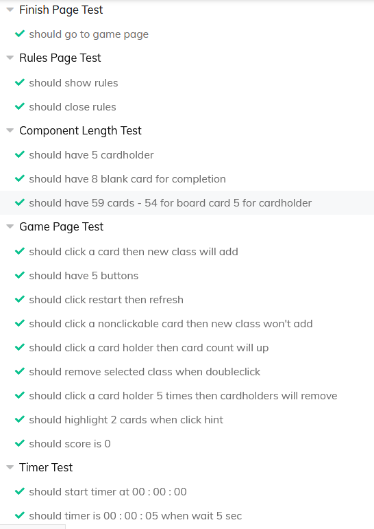
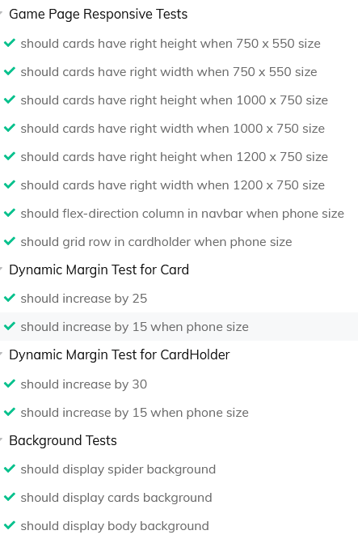
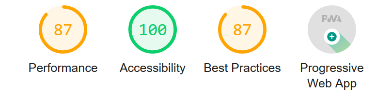

# React - Reversed Spider Solitaire

## Game Description

- It is a card game in which all the cards on the table must be arranged in the order A, 2, 3, 4, 5, 6, 7, 8 ,9 , 10, J, Q, K.
- Playable with both click and drag and drop.
- Suitable for responsive design.

## My Game Rules

### Undo Rules
- You can undo after success placement
- You can undo after distribute new cards
- You cannot undo in a row and after complete deck
- Undo is triggered after you click a card so you cannot undo if any card selected.

### Hint Rules
- If you click the button when there is a selected card, it finds the eligible card and automatically replaces it.
- If no card selected, cards that eligible for replacement are displayed for 2 seconds.

### Blank Area Rules
- You can relocate every card to blank columns. (Can be done with just click )
- You cannot get hint to blank areas.
- You cannot deal new cards if any blank column exist.

## Game Logic

After creating a total of 104 cards consisting of 8 decks, it is divided into 6 columns in the first 4 columns and 5 in the remaining 6 columns.

Each number in the array determines the value of the card in the sample deck and card objects are created based on this value.

<pre> <code> 
constructor(deck, value, show, active){
        this.deck = deck;
        this.value = value;
        this.show = show;
        this.active = active
    }
</code> </pre>

- deck: Represents which deck the card comes from.
- value: Value of card
- show: Determines whether to show the card.
- active: Checks if the card is selected.

Then the cards in each column are connected to each other with a linked list data structure.

<pre> <code>
constructor(val) {
        this.val = val;
        this.next = null;
    }
</code> </pre>

A new object is created from the first card of each column, val key keeps the card information, and the next one keeps the card information after it, all the cards in the column are connected to each other with a loop.

Example:

<pre> <code> 
    val: {
            value: "1",
            deck: 2,
            active: true,
            show: false
        },
        next: {
            val: {
                value: "2",
                deck: 2,
                active: true,
                show: false
            },
            next: {
                val: {
                    value: "3",
                    deck: 4,
                    active: true,
                    show: false
                },
                next: null
            }
        }
    }
    </code> </pre>

54 cards are created this way. The remaining 50 cards are kept as a card object in a array, when the user requests new cards, the linked list is made available with the necessary function and connected to the last card of each column.

 

The cards created in this way perform the necessary controls with various functions in the game, and perform the operations of relocating, undoing and giving hints.

## Folder Structure

### ----- Assets Folder -----
- Includes css files, images and sound.

 

### ----- Components Folder ----- 
### Pages Folder
- There are 2 pages defined in the route. The Game page represents the main screen where the game is played, and the Finish Page represents the screen that will be shown if the game is successfully completed.

<pre> <code>
 .../ => Game Page
 .../finish => Finish Page
</code> </pre>

### Navbar Folder
- Navbar component contains elapsed time, score and buttons with 4 different functions.
- Timer is the component where the elapsed time is calculated.
- ScoreBoard Component shows the score value based on the total number of decks completed.
- Rules component is displayed when the rules button is pressed. Includes game rules.

#### Card Folder
- Default Card Component
- BlankCard Component represents where to position the decks to be completed.
- BlankColumnCard represents the component that will be displayed if cards run out in any column.
- CardTypeFinder determines which image to select based on the cards' values.

### CardHolder Folder
- Represents the cards to be dealt and the area where BlankCard component displayed.

 

### ----- Logic Folder ----- 
- In the first step, CardGenerator performs the creation, shuffling and adaptation of the cards to the linked list structure. Returns the cards on the table and the cards to be dealt.
- The ComponentCreate component handles the correct creation of Card, BlankCard and BlankColumnCard components.
- Gameplay contains all the main functions required to play the game. It performs the main operations such as Card Selection, Relocation, Undo, New Card Distribution, Hinting. It can be called the brain file of the project :) 
- linkedlist puts cards into linked list structure.

 

### ----- test Folder -----
- Includes tests of logical functions.

 

### Other Files
- JunkData contains sample data created for tests.
- useWindowDimensions dynamically calculates the screen width. Required for responsive design. 

## Test Results

### Unit Tests
The logical functions of the game were tested in general and it was seen that 22 successful results were obtained and no errors were found. Test coverage is %71

### Cypress Tests

Tested component and UI using Cypress. A total of 32 tests were performed and no errors were found. Particularly focused on responsive design.

## Lightouse Results

### For Desktop

### For Mobile

## Demo Site
[Reversed Spider Solitaire](https://omer-caliskan-react-solitaire.netlify.app/)
